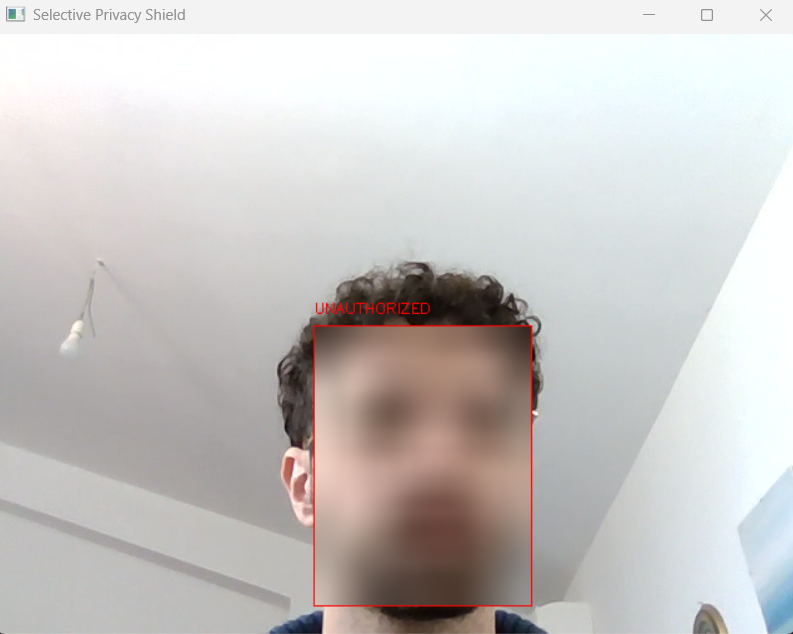

# People Tracking with Face Recognition

This project implements a people tracking system using face recognition powered by the InsightFace library.

It captures video from a webcam, detects faces, extracts facial features, and matches them against a database of known individuals.

The system also includes a Streamlit-based interface for managing the database of known faces.
With the UI, you can view, add a name, or remove individuals from the database.
You can also merge two identities if the system mistakenly creates duplicates.

## Some screenshots

Real time camera feed with detected faces and their attributes:




Streamlit-based manager interface:


Smart merge feature to combine duplicate identities:


## Technologies Used

- DeepFace is integrated for advanced facial recognition capabilities, enhancing the accuracy of identity verification.
- InsightFace serves as the backbone for face detection and recognition, leveraging deep learning models to improve performance.
- FAISS is utilized for fast similarity search and clustering of facial features, which is crucial for matching faces in the database.
- The project also incorporates various techniques for video processing, image handling, and machine learning to enhance the overall functionality of the people tracking system.
- Smoothing algorithms and emotion analysis are implemented to provide additional insights into the detected faces, enriching the user experience.

## Setup Instructions

```bash

virtualenv -p python3.12 venv
source venv/bin/activate # or venv\Scripts\activate.bat (Windows)


pip install insightface onnxruntime opencv-python numpy streamlit faiss-cpu deepface

# For faster performance with GPU support, consider installing faiss-gpu instead of faiss-cpu
# Also consider onnxruntime-gpu for GPU acceleration
```

### To run the app:

First initialize the database:

```bash
python db.py
```

To detect and track people using your webcam, run:

```bash
python main.py
```

For the Streamlit-based manager interface, use:

```bash
streamlit run manager.py
```
